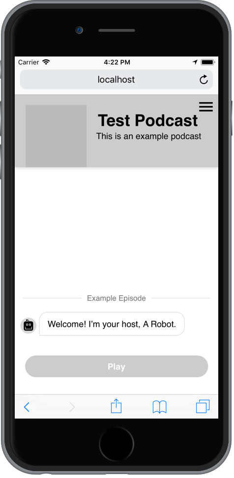

# Podmod

An "augmented" podcast player by the Guardian Mobile Innovation Lab. Delivers links and images to listeners at various marked points during playback.

## State of the project

This is a de-branded version of the code used in the [Strange Bird audio experiment](https://www.theguardian.com/strangebird). As a result of the experiment changing course a few times during development the code isn't very well organised, so I wouldn't recommend taking this wholesale as an audio player. However, you can use it successfully as a proof of concept to experiment with adding annotations to the podcast of your choice. There is also some brand-specific stuff left over e.g. ("Ask Mona a question") because they didn't easily fit into a script and were hardcoded due to time constraints.

## Installing and running

This project requires you have Node installed on your system. To run it, clone this repo, then run:

    npm run install

In the repo directory. Once that has completed, run:

    npm run build-example-podcast

To create an example podcast in `bundles/example-podcast`. This script uses the macOS `say` command to generate an audio file from a script - if your platform doesn't have the say command installed you will need to find an alternative.

Now you should be able to run the project by running:

    npm run dev

then going to http://localhost:8080 in your browser.

## Configuration

The files in the `config` directory set environment variables for each environment - `development.json`, `staging.json` and `production.json`. A `development.json` is created as part of `npm run build-example-podcast`. The config fields are:

* `PUSHKIN_HOST`, `PUSHKIN_KEY`: The configuration for [pushkin-client](https://github.com/gdnmobilelab/pushkin-client). This is used to allow users to subscribe/unsubscribe from new episode alerts.
* `ANALYTICS_ID`: A Google Analytics ID to send various events to as the user interacts with the player. Leave blank to output these to the browser console instead.
* `SCRIPT_URL`: The JSON file that contains the podcast script.

## Editing a script

The example script (at `bundles/example-podcast/script.json` after installation) shows some examples of the different types of annotation you can add to a podcast - text, images and links. You can also combine an image and a link in one annotation, as well as provide multiple images - though that ended up not being used in Strange Bird, it will show the first image and allow you to swipe to the others when in the expanded photo gallery view. All URLs in the script file are relative to the script URL.

---

The example podcast uses a few assets found online:

The robot avatar: [Robot by iconsmind.com from the Noun Project](https://thenounproject.com/search/?q=robot&i=71680)

The 'beep' for new content: https://freesound.org/people/pan14/sounds/263133/

The photo of Manhattan: https://www.flickr.com/photos/henriquev/3365719283
